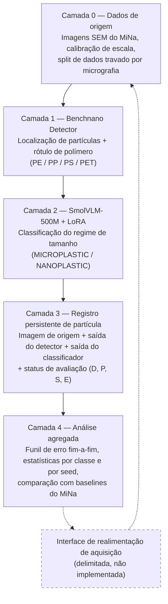

# Benchnano Models

Código, configurações e resultados experimentais do artigo **"Two Stage Vision Pipeline and Layered Provenance Architecture for Microplastic and Nanoplastic Analysis in SEM"** (Evangelista, da Silva, de Jesus, Alexsander, da Silva, Flores, Barros, Guterres, Pimentel Júnior, Dora, Malheiros, Pias — Universidade Federal do Rio Grande, Centro de Ciências Computacionais).

## Sobre o projeto

Imagens de microscopia eletrônica de varredura (SEM) de micro e nanoplásticos contêm campos densos de partículas pequenas com morfologia heterogênea, o que dificulta a análise automatizada em nível de partícula. Este projeto avalia um pipeline de visão computacional em duas etapas sobre o dataset **MiNa** (Microplastics and Nanoplastics):

1. **Benchnano Detector** (baseado em YOLO26L) localiza partículas em uma imagem SEM completa e prediz um de quatro rótulos de polímero (PE, PP, PS, PET).
2. **SmolVLM-500M** (ajustado com LoRA) classifica cada partícula candidata como `MICROPLASTIC` ou `NANOPLASTIC`, usando a imagem e a informação de escala física — sem receber o diâmetro de referência.

Uma arquitetura em camadas preserva a evidência de origem, a proveniência dos modelos e os estados intermediários de cada partícula, permitindo atribuir cada erro à etapa exata que o produziu (detecção, rótulo de polímero ou regime de tamanho), em vez de reportar apenas uma acurácia agregada.

## Arquitetura em camadas



A camada 3 é o registro central: para cada partícula, guarda o identificador da imagem de origem, a caixa predita, o rótulo e a confiança do detector, o regime de tamanho de referência e o predito, e o status de avaliação. A interface de realimentação (linha tracejada) é apenas uma definição de interface para trabalho futuro — o estudo não implementa controle de microscópio nem um laço de retroalimentação físico.

## Principais resultados

Valores reportados como média ± desvio-padrão sobre **10 repetições controladas** (seeds 0–9), a referência mais confiável segundo a própria análise do artigo — os valores de execução única do resumo (*abstract*) ficam, em alguns casos, próximos do limite superior do intervalo de confiança dessas repetições.

| Etapa | Métrica | Resultado (10 repetições) |
|---|---|---|
| Benchnano Detector | Precisão | 65,5% ± 6,1% |
| Benchnano Detector | Recall | 43,0% ± 2,9% |
| Benchnano Detector | mAP@0.5 | 35,8% ± 4,6% |
| Benchnano Detector | mAP@0.5:0.95 | 10,9% ± 2,2% |
| SmolVLM LoRA (regime de tamanho) | Acurácia | 89,8% ± 2,1% |
| SmolVLM full fine-tuning (regime de tamanho) | Acurácia | 87,9% ± 2,0% |
| Pipeline fim-a-fim estrito | Taxa $E = D \cdot P \cdot S$ | 26,6% ± 3,5% |

O dataset MiNa contém 105 micrografias SEM ($1280\times960$ px) e 26.869 partículas anotadas (PE: 616, PP: 8.362, PS: 12.847, PET: 5.044). A partição usa 70/15/15 em nível de micrografia (sem misturar partículas da mesma imagem entre splits); o split de teste travado tem 15 imagens e 4.610 partículas.

Comparação com os baselines do benchmark original do MiNa (mAP@0.5, execução única por método):

| Método | Protocolo imagem completa | Protocolo crop curado |
|---|---|---|
| Benchnano-seg (YOLO26L-seg) | 44,3% | 68,0% |
| Mask R-CNN | 23,0% | 68,7% |
| Faster R-CNN | 21,4% | 58,5% |
| YOLOv10 | 40,3% | 44,1% |

## Estrutura do repositório

O material está organizado nas três categorias de experimentação usadas no projeto, mantidas separadas propositalmente:

```
benchnano_models/
├── experimentos/                 # Estudos-piloto de execução única (VLM, detector, ablações)
│   ├── scripts/                  # 00–55: um script por etapa, numerado na ordem do pipeline
│   └── resultados/                # summary.json, métricas, crops e reports de cada script
│
├── experimentos_comparacao/       # Comparação direta com o benchmark original do MiNa
│   ├── scripts/                  # construção de dataset, treino e avaliação por método
│   ├── resultados/                # 4 métodos (Benchnano-seg, YOLOv10, Faster/Mask R-CNN)
│   │                              #   × 2 protocolos (imagem completa / crop curado)
│   ├── datasets_*/                # anotações COCO/YOLO derivadas (sem as imagens)
│   └── relatorio_final/           # tabelas finais usadas no artigo
│
└── experimentos_controlados/      # Protocolo de repetição controlada (10 seeds)
    ├── scripts/                   # espelham os experimentos de execução única, com seed fixa
    ├── resultados/                # 01–07: uma pasta por configuração, rep_00 .. rep_09
    ├── relatorio_final/            # média, desvio-padrão, IC95% e testes estatísticos
    └── logs_maquina/               # monitoramento contínuo de GPU durante a fila de treino
```

Cada subpasta de `resultados/` corresponde a uma tabela, figura ou número específico do artigo — a numeração dos scripts segue a ordem em que os experimentos aparecem no texto. `experimentos_controlados/README.md` documenta o protocolo de repetição em detalhe.

## Dataset original

O dataset **MiNa (Microplastics and Nanoplastics)**, de Rezvani et al., é a fonte de todas as imagens e anotações usadas neste projeto:

- Coleção de imagens usada neste estudo: [Google Drive](https://drive.google.com/drive/folders/1FSic90KWf_bkYo99IzO3QHRbsC2EXfZk)
- Repositório de código e anotações original: [github.com/naviiidz/MiNa-dataset](https://github.com/naviiidz/MiNa-dataset) (licença MIT)

Nenhuma imagem do MiNa é redistribuída diretamente neste repositório — apenas anotações derivadas, crops pequenos gerados a partir delas, e os scripts que reproduzem esse processamento a partir da coleção original.

## Requisitos e dependências

- `experimentos_controlados/requirements.txt` documenta o ambiente usado nas repetições controladas. `experimentos/` e `experimentos_comparacao/` ainda não têm um arquivo de dependências próprio.
- Pesos pré-treinados de terceiros usados como ponto de partida (`yolo26l.pt` da Ultralytics, `HuggingFaceTB/SmolVLM-500M-Instruct` do Hugging Face) não estão incluídos — devem ser obtidos separadamente pelas fontes oficiais.
- Scripts de `experimentos_controlados/` importam `vlm_common.py` a partir de `experimentos/scripts/`; rodar essa categoria de forma isolada requer manter essa referência.
- Ambiente de treino original: NVIDIA GeForce RTX 4060 Ti (16 GB), Python 3.10.12, PyTorch 2.4.1 (CUDA 12.1), Ultralytics 8.4.126, Transformers 4.49.0.

## Limitações conhecidas

- Avaliação restrita às imagens SEM do MiNa; nenhum dataset externo foi usado para testar transferência de domínio de aquisição.
- O split de teste travado tem apenas 15 micrografias, distribuídas de forma desigual entre rótulos de polímero (PE aparece em só 2 das 15 imagens), o que torna a precisão de PE sensível à seed.
- Os scripts de fine-tuning do SmolVLM não fixam todas as seeds do PyTorch de forma determinística; o protocolo de 10 repetições em `experimentos_controlados/` existe para quantificar essa variabilidade.
- Uma validação cruzada de 5 folds sobre as 102 micrografias disponíveis (exploratória, ver `experimentos/resultados/45_eval_cv_folds`) indica um recall populacional mais conservador (23,8%) que o do split de teste travado (43,0%), sugerindo que este último é uma amostra relativamente favorável de imagens de origem.

## Uso de ferramentas de IA

ChatGPT (OpenAI) e Claude (Anthropic) foram usados para edição de linguagem e organização do manuscrito e deste material de acompanhamento. Citações, métodos, resultados numéricos e conclusões foram verificados pelos autores; essas ferramentas não foram usadas para gerar dados experimentais nem executar as análises estatísticas reportadas.
