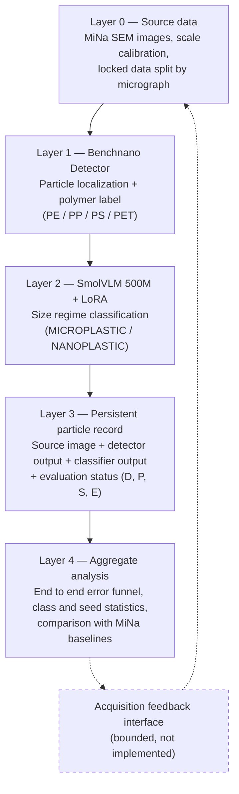

# Benchnano Models

Code, configurations, and experimental results from the paper **"Two Stage Vision Pipeline and Layered Provenance Architecture for Microplastic and Nanoplastic Analysis in SEM"** (Evangelista, da Silva, de Jesus, Alexsander, da Silva, Flores, Barros, Guterres, Pimentel Júnior, Dora, Malheiros, Pias — Federal University of Rio Grande, Center for Computational Sciences).

## About the Project

Scanning electron microscopy (SEM) images of microplastics and nanoplastics contain dense fields of small particles with heterogeneous morphology, which makes automated particle level analysis difficult. This project evaluates a two stage computer vision pipeline on the **MiNa** (Microplastics and Nanoplastics) dataset:

1. **Benchnano Detector** (based on YOLO26L) locates particles in a complete SEM image and predicts one of four polymer labels (PE, PP, PS, PET).
2. **SmolVLM 500M** (fine tuned with LoRA) classifies each candidate particle as `MICROPLASTIC` or `NANOPLASTIC`, using the image and physical scale information without receiving the reference diameter.

A layered architecture preserves source evidence, model provenance, and intermediate states for each particle, allowing each error to be attributed to the exact stage that produced it (detection, polymer label, or size regime), rather than reporting only an aggregate accuracy.

## Layered Architecture



Layer 3 is the central record. For each particle, the source image identifier, predicted bounding box, detector label and confidence, reference and predicted size regime, and evaluation status are stored. The feedback interface shown by the dashed line is only an interface definition for future work. The study does not implement microscope control or a physical feedback loop.

## Main Results

Values are reported as mean ± standard deviation over **10 controlled repetitions** (seeds 0 to 9), which is the most reliable reference according to the analysis presented in the paper. Single run values from the *abstract* are, in some cases, close to the upper bound of the confidence interval from these repetitions.

| Stage                                  | Metric                       | Result (10 repetitions) |
| -------------------------------------- | ---------------------------- | ----------------------- |
| Benchnano Detector                     | Precision                    | 65.5% ± 6.1%            |
| Benchnano Detector                     | Recall                       | 43.0% ± 2.9%            |
| Benchnano Detector                     | mAP@0.5                      | 35.8% ± 4.6%            |
| Benchnano Detector                     | mAP@0.5:0.95                 | 10.9% ± 2.2%            |
| SmolVLM LoRA (size regime)             | Accuracy                     | 89.8% ± 2.1%            |
| SmolVLM full fine tuning (size regime) | Accuracy                     | 87.9% ± 2.0%            |
| Strict end to end pipeline             | Rate $E = D \cdot P \cdot S$ | 26.6% ± 3.5%            |

The MiNa dataset contains 105 SEM micrographs ($1280\times960$ px) and 26,869 annotated particles (PE: 616, PP: 8,362, PS: 12,847, PET: 5,044). The partition uses 70/15/15 at the micrograph level, with particles from the same image never being mixed across splits. The locked test split contains 15 images and 4,610 particles.

Comparison with the original MiNa benchmark baselines (mAP@0.5, single run per method):

| Method                      | Full image protocol | Curated crop protocol |
| --------------------------- | ------------------- | --------------------- |
| Benchnano seg (YOLO26L seg) | 44.3%               | 68.0%                 |
| Mask R CNN                  | 23.0%               | 68.7%                 |
| Faster R CNN                | 21.4%               | 58.5%                 |
| YOLOv10                     | 40.3%               | 44.1%                 |

## Repository Structure

The material is organized into the three experimental categories used in the project, which are intentionally kept separate:

```
benchnano_models/
├── experimentos/                 # Single run pilot studies (VLM, detector, ablations)
│   ├── scripts/                  # 00–55: one script per stage, numbered according to pipeline order
│   └── resultados/               # summary.json, metrics, crops, and reports from each script
│
├── experimentos_comparacao/      # Direct comparison with the original MiNa benchmark
│   ├── scripts/                  # dataset construction, training, and evaluation by method
│   ├── resultados/               # 4 methods (Benchnano seg, YOLOv10, Faster/Mask R CNN)
│   │                              #   × 2 protocols (full image / curated crop)
│   ├── datasets_*/                # derived COCO/YOLO annotations (without images)
│   └── relatorio_final/           # final tables used in the paper
│
└── experimentos_controlados/     # Controlled repetition protocol (10 seeds)
    ├── scripts/                  # mirror the single run experiments, with a fixed seed
    ├── resultados/               # 01–07: one folder per configuration, rep_00 .. rep_09
    ├── relatorio_final/           # mean, standard deviation, 95% CI, and statistical tests
    └── logs_maquina/              # continuous GPU monitoring during the training queue
```

Each `resultados/` subfolder corresponds to a specific table, figure, or number in the paper. Script numbering follows the order in which the experiments appear in the text. `experimentos_controlados/README.md` documents the repetition protocol in detail.

## Original Dataset

The **MiNa (Microplastics and Nanoplastics)** dataset, by Rezvani et al., is the source of all images and annotations used in this project:

* Image collection used in this study: [Google Drive](https://drive.google.com/drive/folders/1FSic90KWf_bkYo99IzO3QHRbsC2EXfZk)
* Original code and annotation repository: [github.com/naviiidz/MiNa dataset](https://github.com/naviiidz/MiNa-dataset) (MIT license)

No MiNa images are redistributed directly in this repository. Only derived annotations, small crops generated from them, and the scripts required to reproduce this processing from the original collection are included.

## Requirements and Dependencies

* `experimentos_controlados/requirements.txt` documents the environment used for the controlled repetitions. `experimentos/` and `experimentos_comparacao/` do not yet have their own dependency files.
* Third party pretrained weights used as starting points (`yolo26l.pt` from Ultralytics, `HuggingFaceTB/SmolVLM 500M Instruct` from Hugging Face) are not included. They must be obtained separately from the official sources.
* Scripts in `experimentos_controlados/` import `vlm_common.py` from `experimentos/scripts/`. Running this category in isolation requires maintaining this reference.
* Original training environment: NVIDIA GeForce RTX 4060 Ti (16 GB), Python 3.10.12, PyTorch 2.4.1 (CUDA 12.1), Ultralytics 8.4.126, Transformers 4.49.0.

## Known Limitations

* Evaluation is restricted to SEM images from MiNa. No external dataset was used to test acquisition domain transfer.
* The locked test split contains only 15 micrographs, distributed unevenly across polymer labels. PE appears in only 2 of the 15 images, which makes PE precision sensitive to the seed.
* The SmolVLM fine tuning scripts do not fix all PyTorch seeds deterministically. The 10 repetition protocol in `experimentos_controlados/` is used to quantify this variability.
* A 5 fold cross validation over the 102 available micrographs (exploratory, see `experimentos/resultados/45_eval_cv_folds`) indicates a more conservative population recall (23.8%) than that obtained from the locked test split (43.0%), suggesting that the latter is a relatively favorable sample of source images.

reported statistical analyses.
